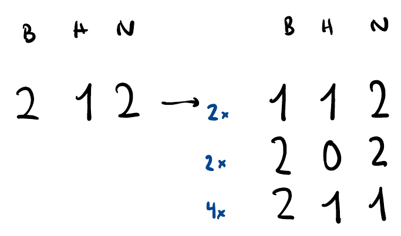

# Intuitive Approach to Solve Probability-DP Tasks

Disclaimer: This blogpost walks through Island Tribes as an exemplary CE Task which we had during our semester, so beware of spoilers in case you haven't solved it yet. 

The type of problems that typically require a DP Approach are the problems which contain probabilistic decisions happening in a period of time, until some condition is reached. 

Let's look at the example of the Island Tribes task and draw a tree with possible outcomes by hand, in order to derive our Recurrence. This is in general a safe bet - to work it out by hand for a small example first.

## Island Tribes
The inhabitants of an island are divided into three tribes: Bears, Hunters, and Ninjas. They are very hostile, and whenever two members of different tribes meet, the stronger one *always* eliminates the weaker one, à la survival of the fittest. It is known that

- a bear is stronger than a ninja
- a ninja is stronger than a hunter
- a hunter is stronger than a bear

The hostility goes on until only one tribe remains. What is the probability that each tribe is the last one standing, given initial population size?

Say we start with `2 bears, 1 hunter, 2 ninjas`. We denote one time step as an occurrence of two members of distinct tribes meeting (if two of the same tribes meet, nothing happens). At time step 0 we have `2-1-2` (b-h-n). At time step 1, we have 2 possible ways for a bear to be eliminated. Hunters kill bears, and since we have 1 Hunter and 2 Bears, there are `2*1` possible ways a Bear can get removed, either the first hunter kills the first bear or the first hunter kills the second bear. Similarly,  we have 2 possible ways for a Hunter to get removed, since ninjas are stronger than hunters and there are 2 ninjas and 1 hunter. Lastly, we have 4 possible ways that a Ninja can get removed, since there are 2 ninjas and 2 bears, while bears are stronger than ninjas, which results in `2*2=4` distinct pairs of one ninja and one bear each. 

Now what is the probability of reaching for instance the state `1 1 2` (B-H-N)? We have `2+2+4` total hostile meetings that are possible, 2 of which result in a bear being eliminated (reaching `1 1 2` from `2 1 2`). Hence, the probability to get `1 1 2` is $\frac{2}{8}=0.25$. We can generalize this.

What is the probability of reaching `0 1 2`? Well, we have a `0.25` probability of getting to `1 1 2` and a $\frac{1*1}{1*1 + 1*2 + 2*1} = 0.2$ probability of reaching `0 1 2` from there. So from the initial state `2 1 2` we have a 0.25*0.2 probability to reach `0 1 2`. Now what is the probability to get to any endings that end up with the Bears being the tribe remaining? 

Let us denote $\mathcal{B}[B,H,N]$ as the probability of Bears remaining at the end, given B bears, H hunters, and N ninjas. Following the Law of Total Probability, we get

$$
\mathcal{B}[B,H,N] = \mathcal{B}[B-1,H,N]*Pr[\text{bear killed}] + \mathcal{B}[B,H-1,N]*Pr[\text{hunter killed}] + \mathcal{B}[B,H,N-1]*Pr[\text{bear killed}]
$$

We notice that

$$
Pr[\text{bear killed}] = \frac{\text{#bears}*\text{#hunters}}{\text{#bears}*\text{#hunters} + \text{#hunters}*\text{#ninjas} + \text{#ninja}*\text{#bear}} = \frac{bh}{bh+hn+nj}
$$

and analogously:

$$Pr[\text{hunter killed}] = \frac{hn}{bh+hn+nj} \text{ and } Pr[\text{ninja killed}] = \frac{nj}{bh+hn+nj}$$

Filling this into the recurrence above gives us

$$
\begin{aligned}
\mathcal{B}[B,H,N] & = \mathcal{B}[B-1,H,N]*\frac{bh}{bh+hn+nj} + \mathcal{B}[B,H-1,N]*\frac{hn}{bh+hn+nj} + \mathcal{B}[B,H,N-1]*\frac{nj}{bh+hn+nj} \\
\mathcal{B}[B,H,N] & = \frac{\mathcal{B}[B-1,H,N]*bh + \mathcal{B}[B,H-1,N]*hn + \mathcal{B}[B,H,N-1]*nj}{bh+bn+nj}

\end{aligned}
$$

We have the base case

$$
\mathcal{B}[i,0,0]=
\begin{cases}
1 & i>0 \text{ "bear is the only tribe left"}\\
2 & i=0\text{ "no tribes left"}\\
\end{cases}
$$

#### Top-Down Way
To do it Top-Down, we define a function to recursively calculate these Probabilities. Before returning, we save the values and before every recursion we check if we already previously calculated the entry. This way we save a lot of computation, the ones ticked in orange in the above image.
#### Bottom-Up Way
We loop over the 3 dimensions of the DP-Table $\mathcal{B}$ i.e. an array of dimensions `(b+1)x(h+1)x(n+1)`, calculating the new value $\mathcal{B}[B][H]][N]$ from the entries we calculated in the respective previous iterations. This is quite elegant. 
#### Base case

Now that we know the probability that the bears are the last remaining tribe, we can retrieve the probability of the hunter winning and the probability of the ninja winning as well.

For that, we notice that the to calculate the probabilities for the hunters winning, we only change the base case to be
$$
\mathcal{H}[0,i,0]=
\begin{cases}
1 & i>0 \text{ "hunter is the only tribe left"}\\
2 & i=0\text{ "no tribes left"}\\
\end{cases}
$$
and for the ninjas:

$$
\mathcal{N}[0,0,i]=
\begin{cases}
1 & i>0 \text{ "ninja is the only tribe left"}\\
2 & i=0\text{ "no tribes left"}\\
\end{cases}
$$

Hence, since the recurrence is the same otherwise, we observe that:
$\mathcal{H}[B,H,N] = \mathcal{B}[H,N,B] \text{ and } \mathcal{N}[B,H,N] = \mathcal{B}[N,B,H]$

Therefore we can calculate the probability of any one of the tribes winning as the respective cyclic rotation of the original DP-Array $\mathcal{B}$. We initialize our base-case (for $\mathcal{B}$) and then simply do 3 loops (nested) to loop over values of B, H, and N bottom-up, and calculate the new DP-Entries of $\mathcal{B}$ using the recurrence we derived from the initial drawing by hand, effectively re-using the previously calculated values.

## Slay the Dragon

We have to calculate the expected value (Erwartungswert) of needed spells to kill the dragon. This is also a probability DP exercise, the difference being that we have to determine the Erwartungswert from the Probability-DP-Array in the end. For this, it is essential to know the Law of total Expectation, in addition to the Law of total Probability (used in pretty much all of these types of tasks).

## Winter Season

This is a quite straightforward and stereotypical DP-Probability, comparatively easier than the other ones. Drawing the tree again gives us the recurrence needed.

## Recipe

1) Draw a small example by hand
2) What variables make up the states? In the case of Island Tribes, this was the amount of bears, hunters, and ninjas. It is easiest if you attribute one DP-Dimension to each of these variables. Most of the time, you can save memory by overwriting old DP values when it's not necessary to save all of them, however that is not needed and the intuitive way is sufficient (hopefully).
3) Derive the recurrence from this using the Law of Total Probability and some pondering about how you get from one state to another in the example you drew
4) Figure out the base case, depends on what the tasks asks from you to deliver the probability of
5) Read out the correct value(s) to determine the result (or what you need to get to the result)

- If you have many test cases and the calculation of the DP entries is the same across them all, then only calculate everything once (for the max params as dimensions) and not every time over again
- beware of rounding mistakes attributed to dividing two ints/longs
- off-by-one in for loop conditions or in recurrences are common

*Hope you enjoyed :) ~Tobi*

